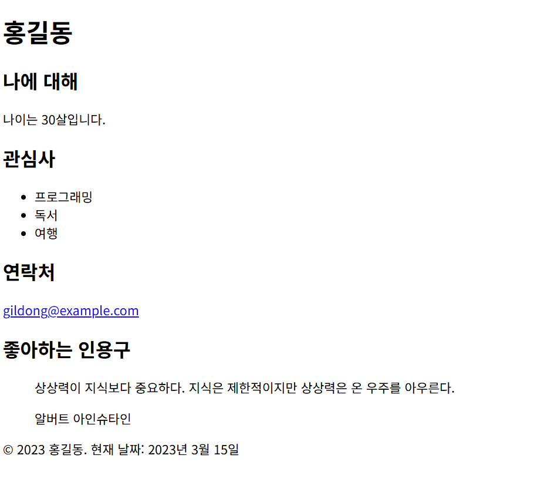

# 실습 문제: 간단한 개인 소개 페이지 만들기

**목표:** 
HTML만을 사용하여 자신의 간단한 개인 소개 페이지를 만들어보세요.

**요구 사항:**

1. HTML5 문서 형식을 사용하세요.
2. 다음 정보를 포함해야 합니다:
   - 이름
   - 나이
   - 관심사 (최대 3개)
   - 연락처 (이메일 또는 전화번호 중 하나)
   - 좋아하는 인용구
3. 제목(title)은 "내 소개"로 설정하세요.
4. 헤더(header)에 이름을 큰 글씨로 표시하세요.
5. 본문(content)에 나머지 정보를 구조화하여 표시하세요.
6. 관심사를 순서 없는 목록(unordered list)로 표시하세요.
7. 인용구는 blockquote 태그를 사용하여 강조하세요.
8. 연락처는 링크(a 태그)를 사용하여 표시하세요.
9. 페이지 하단에 현재 날짜를 표시하세요.
