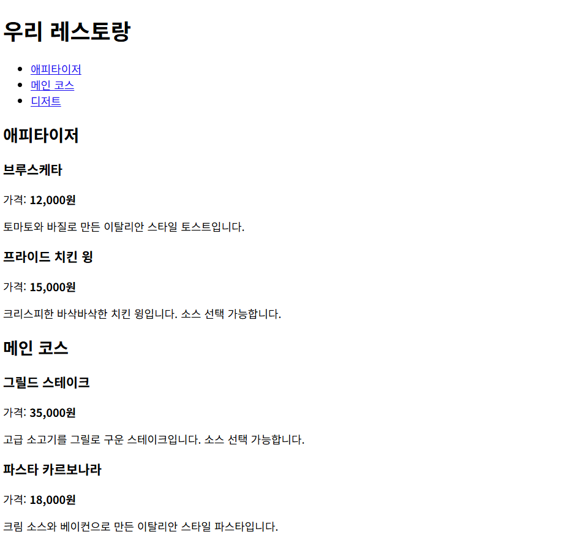
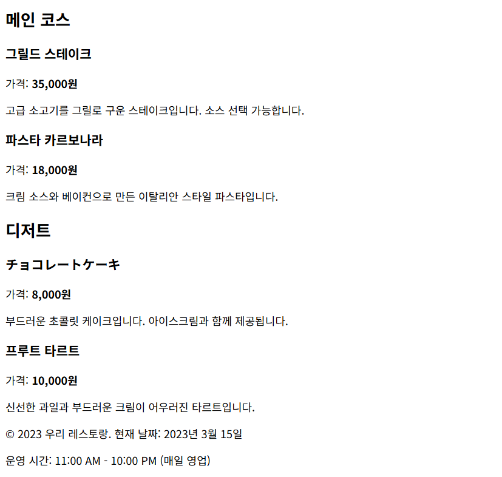

### 실습 문제: 레스토랑 메뉴 페이지 만들기

**목표:**
HTML만을 사용하여 간단한 레스토랑 메뉴 페이지를 만들어보세요.

**요구 사항:**

1. HTML5 문서 형식을 사용하세요.
2. 다음 정보를 포함해야 합니다:
   - 레스토랑 이름
   - 메뉴 카테고리 (최소 3개, 예: 애피타이저, 메인 코스, 디저트)
   - 각 카테고리에 해당하는 메뉴 아이템들 (각 카테고리별로 2~3개)
   - 메뉴 아이템 정보: 이름, 가격, 설명
3. 제목(title)은 "우리 레스토랑 메뉴"로 설정하세요.
4. 헤더(header)에 레스토랑 이름을 표시하세요.
5. 네비게이션 메뉴를 만들어 각 카테고리로 이동할 수 있도록 하세요.
6. 본문(content)에 메뉴 카테고리를 구조화하여 표시하세요.
7. 각 메뉴 아이템은 `<article>` 태그로 감싸세요.
8. 메뉴 아이템 가격은 `<strong>` 태그로 강조하세요.
9. 메뉴 아이템 설명은 `<p>` 태그로 표시하세요.
10. 페이지 하단에 현재 날짜와 운영 시간을 표시하세요.

**제약 조건:**
- CSS나 JavaScript를 사용하지 말고, 오직 HTML만 사용하세요.
- 모든 내용은 한 파일에 포함되어야 합니다.

**시작 코드:**
```html
<!DOCTYPE html>
<html lang="ko">
<head>
    <meta charset="UTF-8">
    <meta name="viewport" content="width=device-width, initial-scale=1.0">
    <title>우리 레스토랑 메뉴</title>
</head>
<body>
    <!-- 여기에 내용을 추가하세요 -->
</body>
</html>
```

**과제 수행 방법:**
1. 위의 시작 코드를 복사하여 새로운 HTML 파일을 만듭니다.
2. `<body>` 태그 안에 요구 사항에 맞는 내용을 추가합니다.
3. 각 섹션을 적절한 HTML 태그로 구조화합니다.
4. 모든 요구 사항을 충족시키는지 확인합니다.
5. 완성된 페이지를 웹 브라우저에서 열어 결과를 확인합니다.

**힌트:**
- `<nav>` 태그를 사용하여 네비게이션 메뉴를 만들 수 있습니다.
- `<ul>` 태그를 사용하여 메뉴 카테고리 목록을 만들 수 있습니다.
- `<dl>` (definition list) 태그를 사용하여 메뉴 아이템과 설명을 연결할 수 있습니다.
- `<footer>` 태그를 사용하여 페이지 하단의 정보를 구조화할 수 있습니다.
- `<time>` 태그를 사용하여 현재 날짜와 운영 시간을 표시할 수 있습니다.
