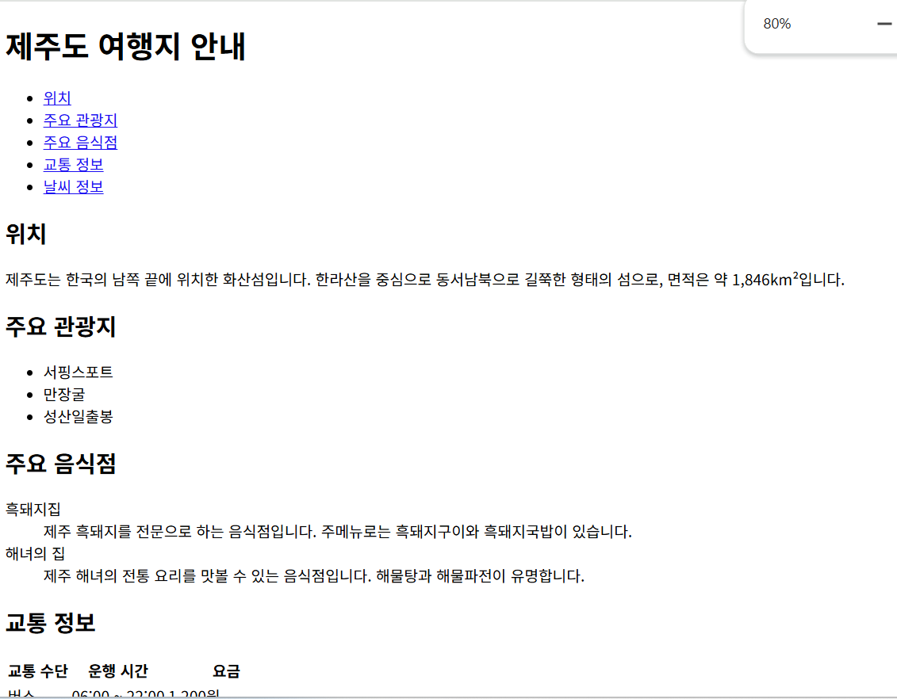
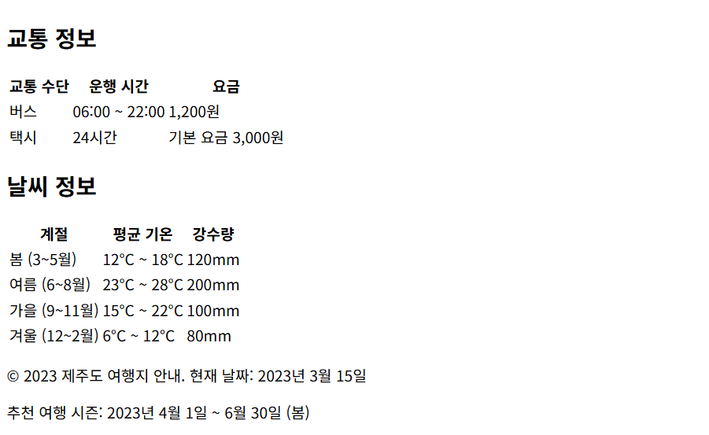

### 실습 문제: 여행지 안내 페이지 만들기

**목표:**
HTML만을 사용하여 간단한 여행지 안내 페이지를 만들어보세요.

**요구 사항:**

1. HTML5 문서 형식을 사용하세요.
2. 다음 정보를 포함해야 합니다:
   - 여행지 이름
   - 위치
   - 주요 관광지 (최소 3곳)
   - 주요 음식점 (최소 2곳)
   - 교통 정보
   - 날씨 정보
3. 제목(title)은 "여행지 안내"로 설정하세요.
4. 헤더(header)에 여행지 이름을 표시하세요.
5. 네비게이션 메뉴를 만들어 각 섹션으로 이동할 수 있도록 하세요.
6. 본문(content)에 여행지 정보를 구조화하여 표시하세요.
7. 주요 관광지는 `<ul>` 태그를 사용하여 목록으로 표시하세요.
8. 음식점 정보는 `<dl>` (definition list) 태그를 사용하여 표시하세요.
9. 교통 정보와 날씨 정보는 `<table>` 태그를 사용하여 표 형식으로 표시하세요.
10. 페이지 하단에 현재 날짜와 추천 여행 시즌을 표시하세요.

**제약 조건:**
- CSS나 JavaScript를 사용하지 말고, 오직 HTML만 사용하세요.
- 모든 내용은 한 파일에 포함되어야 합니다.

**시작 코드:**
```html
<!DOCTYPE html>
<html lang="ko">
<head>
    <meta charset="UTF-8">
    <meta name="viewport" content="width=device-width, initial-scale=1.0">
    <title>여행지 안내</title>
</head>
<body>
    <!-- 여기에 내용을 추가하세요 -->
</body>
</html>
```

**과제 수행 방법:**
1. 위의 시작 코드를 복사하여 새로운 HTML 파일을 만듭니다.
2. `<body>` 태그 안에 요구 사항에 맞는 내용을 추가합니다.
3. 각 섹션을 적절한 HTML 태그로 구조화합니다.
4. 모든 요구 사항을 충족시키는지 확인합니다.
5. 완성된 페이지를 웹 브라우저에서 열어 결과를 확인합니다.

**힌트:**
- `<nav>` 태그를 사용하여 네비게이션 메뉴를 만들 수 있습니다.
- `<section>` 태그를 사용하여 각 정보 섹션(관광지, 음식점 등)을 구조화할 수 있습니다.
- `<figure>`와 `<figcaption>` 태그를 사용하여 여행지 이미지와 설명을 함께 표시할 수 있습니다.
- `<footer>` 태그를 사용하여 페이지 하단의 정보를 구조화할 수 있습니다.
- `<time>` 태그를 사용하여 현재 날짜와 추천 여행 시즌을 표시할 수 있습니다.
- `<abbr>` 태그를 사용하여 약어(예: km, °C)를 확장할 수 있습니다.
- `<q>` 태그를 사용하여 지역 특산물이나 유명한 맛집의 간략한 소개 문구를 인용할 수 있습니다.

이 실습을 통해 HTML의 구조화 능력과 다양한 태그들의 사용법을 연습할 수 있으며, 복잡한 콘텐츠를 효과적으로 구조화하는 방법을 익힐 수 있습니다. 또한, 의미론적 마크업의 중요성을 다시 한번 경험할 수 있을 것입니다.