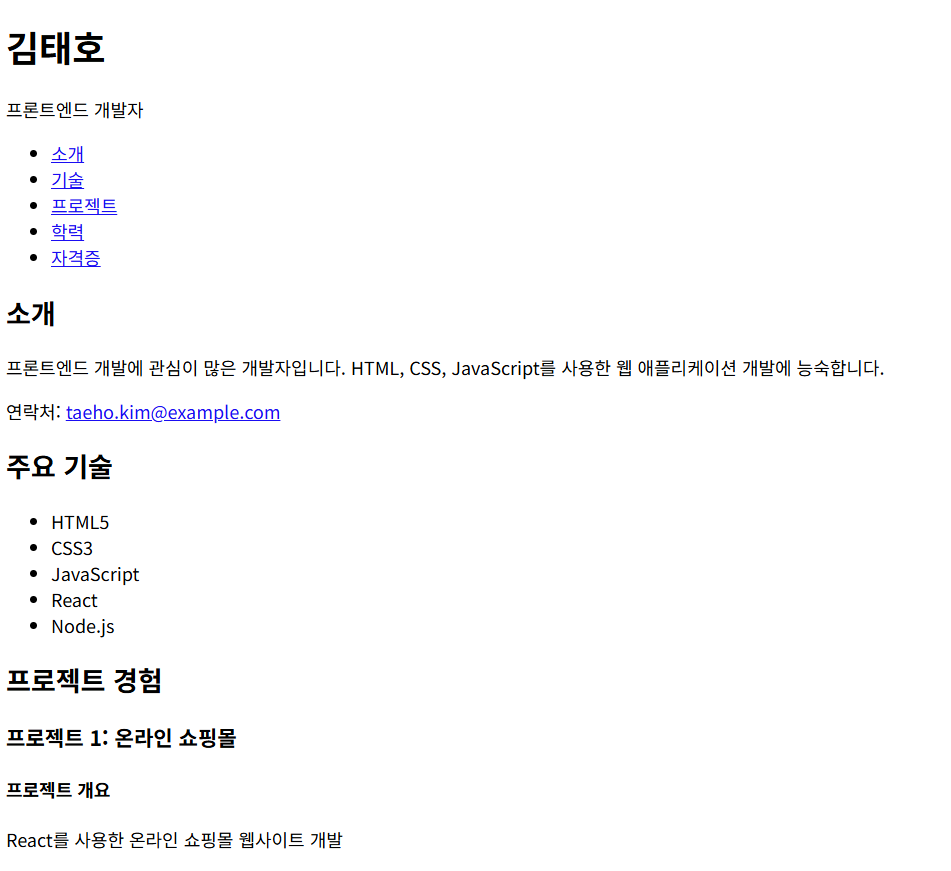
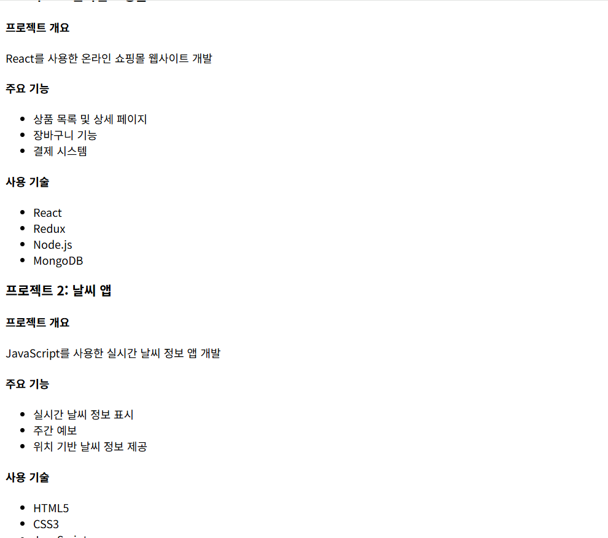
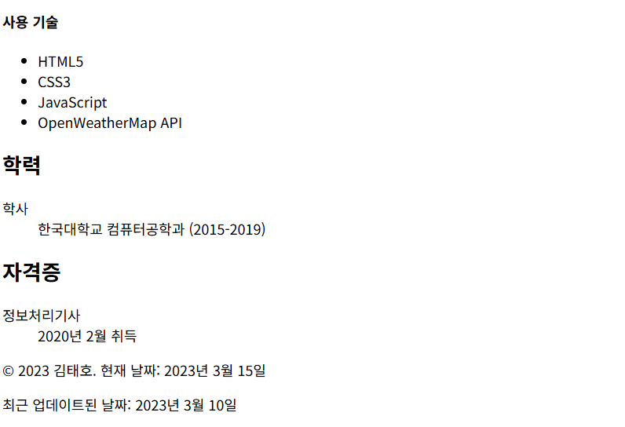

### 실습 문제: 포트폴리오 웹사이트 만들기

**목표:**
HTML만을 사용하여 간단한 포트폴리오 웹사이트를 만들어보세요.

**요구 사항:**

1. HTML5 문서 형식을 사용하세요.
2. 다음 정보를 포함해야 합니다:
   - 이름
   - 직업/직무
   - 연락처 (이메일 또는 전화번호 중 하나)
   - 주요 기술 (최소 3개)
   - 프로젝트 경험 (최소 2개)
   - 학력
   - 자격증 (최소 1개)
3. 제목(title)은 "내 포트폴리오"로 설정하세요.
4. 헤더(header)에 이름과 직업을 표시하세요.
5. 네비게이션 메뉴를 만들어 각 섹션으로 이동할 수 있도록 하세요.
6. 본문(content)에 포트폴리오 정보를 구조화하여 표시하세요.
7. 주요 기술은 `<ul>` 태그를 사용하여 순서 없는 목록으로 표시하세요.
8. 프로젝트 경험은 `<article>` 태그로 감싸고, 각 프로젝트는 `<section>` 태그로 구조화하세요.
9. 학력과 자격증은 `<dl>` (definition list) 태그를 사용하여 표시하세요.
10. 페이지 하단에 현재 날짜와 최근 업데이트된 날짜를 표시하세요.

**제약 조건:**
- CSS나 JavaScript를 사용하지 말고, 오직 HTML만 사용하세요.
- 모든 내용은 한 파일에 포함되어야 합니다.

**시작 코드:**
```html
<!DOCTYPE html>
<html lang="ko">
<head>
    <meta charset="UTF-8">
    <meta name="viewport" content="width=device-width, initial-scale=1.0">
    <title>내 포트폴리오</title>
</head>
<body>
    <!-- 여기에 내용을 추가하세요 -->
</body>
</html>
```

**과제 수행 방법:**
1. 위의 시작 코드를 복사하여 새로운 HTML 파일을 만듭니다.
2. `<body>` 태그 안에 요구 사항에 맞는 내용을 추가합니다.
3. 각 섹션을 적절한 HTML 태그로 구조화합니다.
4. 모든 요구 사항을 충족시키는지 확인합니다.
5. 완성된 페이지를 웹 브라우저에서 열어 결과를 확인합니다.

**힌트:**
- `<nav>` 태그를 사용하여 네비게이션 메뉴를 만들 수 있습니다.
- `<header>` 태그 안에 이름과 직업을 표시할 수 있습니다.
- `<main>` 태그를 사용하여 주요 콘텐츠를 구조화할 수 있습니다.
- `<section>` 태그를 사용하여 각 정보 섹션(기술, 프로젝트 경험 등)을 구조화할 수 있습니다.
- `<figure>`와 `<figcaption>` 태그를 사용하여 프로젝트 관련 이미지와 설명을 함께 표시할 수 있습니다.
- `<footer>` 태그를 사용하여 페이지 하단의 정보를 구조화할 수 있습니다.
- `<time>` 태그를 사용하여 현재 날짜와 최근 업데이트된 날짜를 표시할 수 있습니다.
- `<abbr>` 태그를 사용하여 약어(예: HTML)를 확장할 수 있습니다.
- `<q>` 태그를 사용하여 프로젝트의 특징이나 목표를 인용할 수 있습니다.