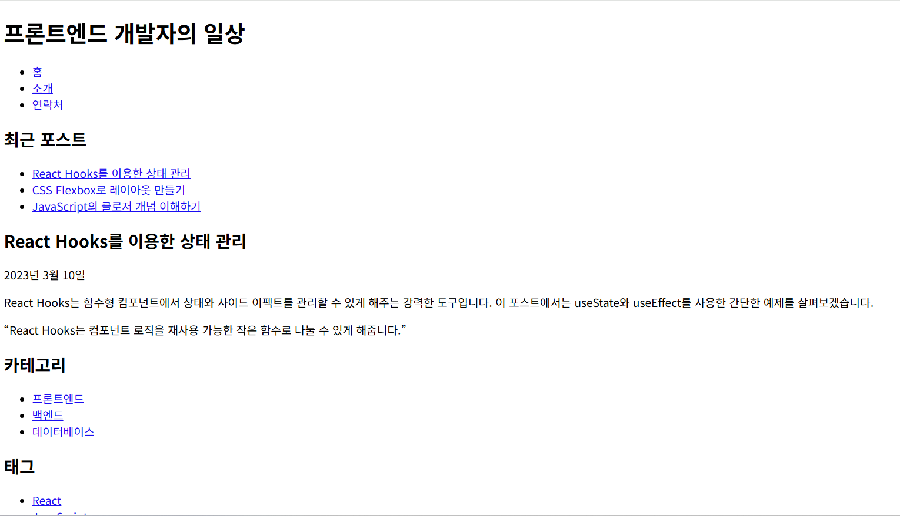
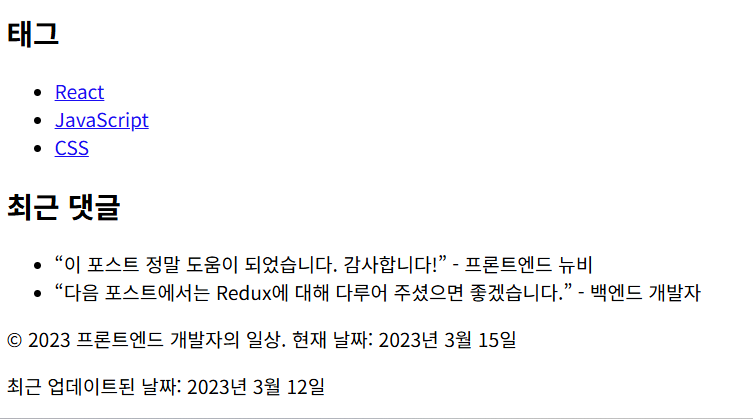

### 실습 문제: 블로그 레이아웃 만들기

**목표:**
HTML만을 사용하여 간단한 블로그 레이아웃을 만들어보세요.

**요구 사항:**

1. HTML5 문서 형식을 사용하세요.
2. 다음 정보를 포함해야 합니다:
   - 블로그 제목
   - 최근 포스트 목록 (최소 3개)
   - 포스트 내용 (최소 1개)
   - 카테고리 목록
   - 태그 목록
   - 최근 댓글 목록 (최소 2개)
3. 제목(title)은 "내 블로그"로 설정하세요.
4. 헤더(header)에 블로그 제목을 표시하세요.
5. 네비게이션 메뉴를 만들어 주요 섹션으로 이동할 수 있도록 하세요.
6. 본문(content)에 블로그 내용을 구조화하여 표시하세요.
7. 최근 포스트 목록은 `<ul>` 태그를 사용하여 순서 없는 목록으로 표시하세요.
8. 포스트 내용은 `<article>` 태그로 감싸세요.
9. 카테고리와 태그 목록은 `<nav>` 태그 내에 `<ul>` 태그를 사용하여 표시하세요.
10. 최근 댓글 목록은 `<aside>` 태그 내에 `<ul>` 태그를 사용하여 표시하세요.
11. 페이지 하단에 현재 날짜와 최근 업데이트된 날짜를 표시하세요.

**제약 조건:**
- CSS나 JavaScript를 사용하지 말고, 오직 HTML만 사용하세요.
- 모든 내용은 한 파일에 포함되어야 합니다.

**시작 코드:**
```html
<!DOCTYPE html>
<html lang="ko">
<head>
    <meta charset="UTF-8">
    <meta name="viewport" content="width=device-width, initial-scale=1.0">
    <title>내 블로그</title>
</head>
<body>
    <!-- 여기에 내용을 추가하세요 -->
</body>
</html>
```

**과제 수행 방법:**
1. 위의 시작 코드를 복사하여 새로운 HTML 파일을 만듭니다.
2. `<body>` 태그 안에 요구 사항에 맞는 내용을 추가합니다.
3. 각 섹션을 적절한 HTML 태그로 구조화합니다.
4. 모든 요구 사항을 충족시키는지 확인합니다.
5. 완성된 페이지를 웹 브라우저에서 열어 결과를 확인합니다.

**힌트:**
- `<nav>` 태그를 사용하여 네비게이션 메뉴와 카테고리/태그 목록을 만들 수 있습니다.
- `<header>` 태그 안에 블로그 제목을 표시할 수 있습니다.
- `<main>` 태그를 사용하여 주요 콘텐츠를 구조화할 수 있습니다.
- `<article>` 태그를 사용하여 각 포스트를 구조화할 수 있습니다.
- `<section>` 태그를 사용하여 각 정보 섹션(최근 포스트, 포스트 내용 등)을 구조화할 수 있습니다.
- `<aside>` 태그를 사용하여 사이드바(최근 댓글 등)를 구조화할 수 있습니다.
- `<footer>` 태그를 사용하여 페이지 하단의 정보를 구조화할 수 있습니다.
- `<time>` 태그를 사용하여 포스트 작성일과 현재 날짜를 표시할 수 있습니다.
- `<q>` 태그를 사용하여 포스트의 주요 인용구나 댓글 내용을 인용할 수 있습니다.