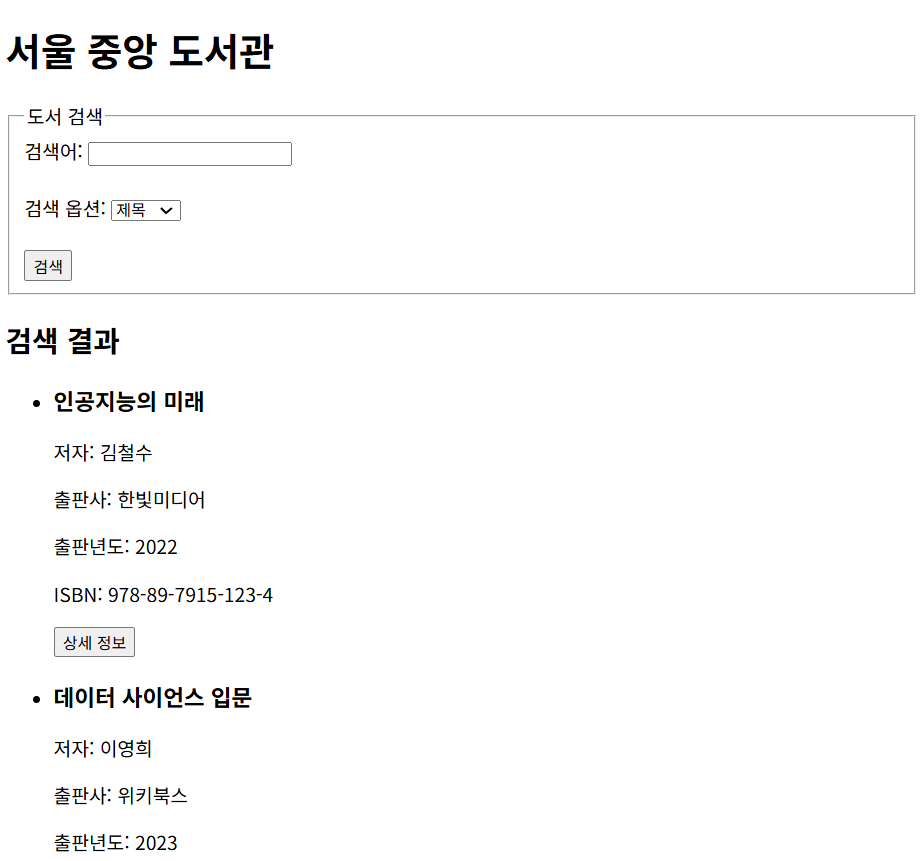
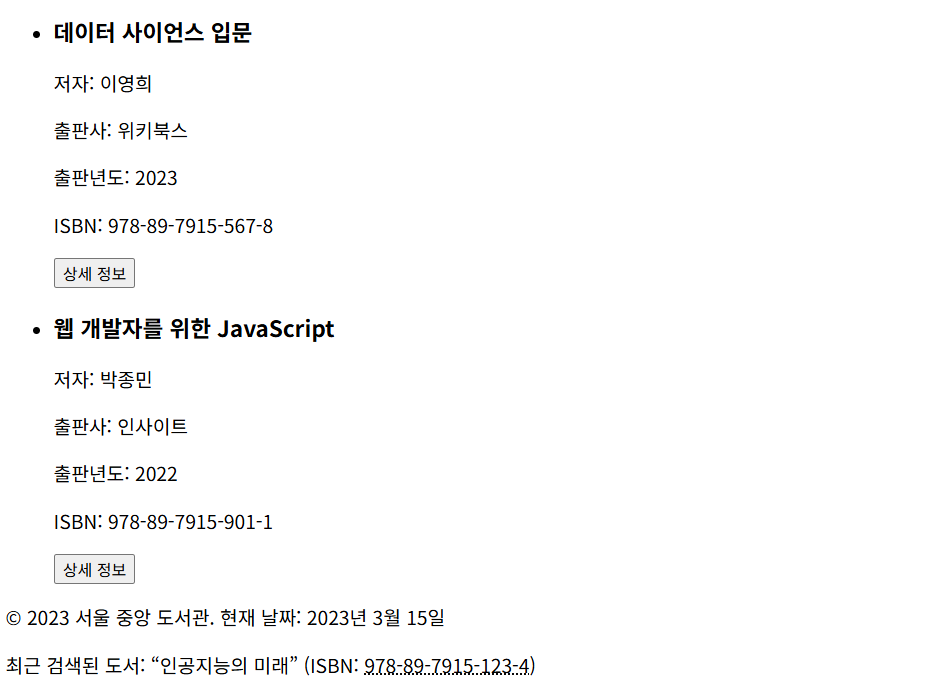

### 실습 문제: 도서관 카탈로그 검색 시스템 만들기

**목표:**
HTML만을 사용하여 간단한 도서관 카탈로그 검색 시스템을 만들어보세요.

**요구 사항:**

1. HTML5 문서 형식을 사용하세요.
2. 다음 정보를 포함해야 합니다:
   - 도서관 이름
   - 검색 폼 (제목, 저자, ISBN 등)
   - 검색 옵션 (제목, 저자, ISBN 중 선택)
   - 검색 결과 목록 (최소 3개)
   - 각 도서 정보 (제목, 저자, 출판사, 출판년도, ISBN)
   - 도서 상세 정보 버튼
3. 제목(title)은 "도서관 카탈로그 검색"으로 설정하세요.
4. 헤더(header)에 도서관 이름을 표시하세요.
5. 본문(content)에 검색 폼과 검색 결과를 구조화하여 표시하세요.
6. 검색 폼은 `<form>` 태그를 사용하여 구현하세요.
7. 검색 결과 목록은 `<ul>` 태그를 사용하여 순서 없는 목록으로 표시하세요.
8. 각 도서 정보는 `<article>` 태그로 감싸세요.
9. 도서 상세 정보 버튼은 `<button>` 태그를 사용하세요.
10. 페이지 하단에 현재 날짜와 최근 검색된 도서를 표시하세요.

**제약 조건:**
- CSS나 JavaScript를 사용하지 말고, 오직 HTML만 사용하세요.
- 모든 내용은 한 파일에 포함되어야 합니다.

**시작 코드:**
```html
<!DOCTYPE html>
<html lang="ko">
<head>
    <meta charset="UTF-8">
    <meta name="viewport" content="width=device-width, initial-scale=1.0">
    <title>도서관 카탈로그 검색</title>
</head>
<body>
    <!-- 여기에 내용을 추가하세요 -->
</body>
</html>
```

**과제 수행 방법:**
1. 위의 시작 코드를 복사하여 새로운 HTML 파일을 만듭니다.
2. `<body>` 태그 안에 요구 사항에 맞는 내용을 추가합니다.
3. 각 섹션을 적절한 HTML 태그로 구조화합니다.
4. 모든 요구 사항을 충족시키는지 확인합니다.
5. 완성된 페이지를 웹 브라우저에서 열어 결과를 확인합니다.

**힌트:**
- `<header>` 태그 안에 도서관 이름을 표시할 수 있습니다.
- `<main>` 태그를 사용하여 주요 콘텐츠를 구조화할 수 있습니다.
- `<fieldset>` 태그를 사용하여 검색 폼을 그룹화할 수 있습니다.
- `<legend>` 태그를 사용하여 검색 폼의 제목을 표시할 수 있습니다.
- `<label>` 태그를 사용하여 입력 필드와 설명을 연결할 수 있습니다.
- `<select>` 태그를 사용하여 검색 옵션을 선택할 수 있는 드롭다운 메뉴를 만들 수 있습니다.
- `<footer>` 태그를 사용하여 페이지 하단의 정보를 구조화할 수 있습니다.
- `<time>` 태그를 사용하여 현재 날짜를 표시할 수 있습니다.
- `<abbr>` 태그를 사용하여 약어(예: ISBN)를 확장할 수 있습니다.
- `<q>` 태그를 사용하여 도서의 간략한 소개나 주요 내용을 인용할 수 있습니다.
